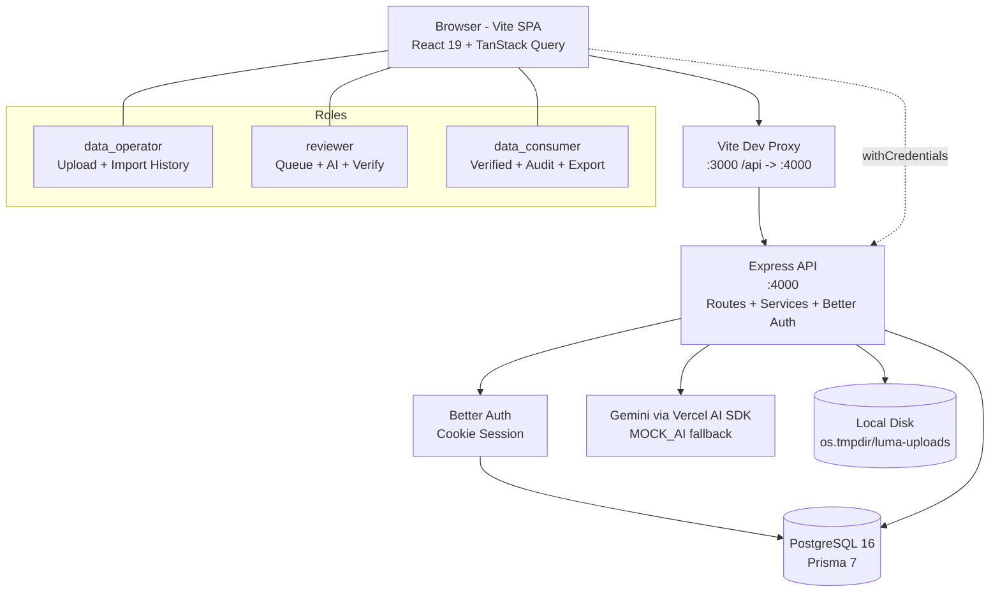
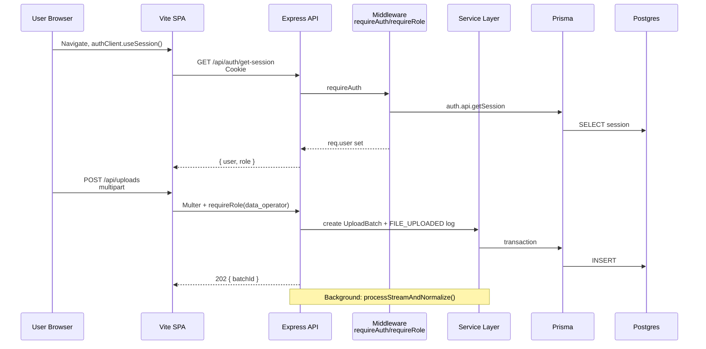
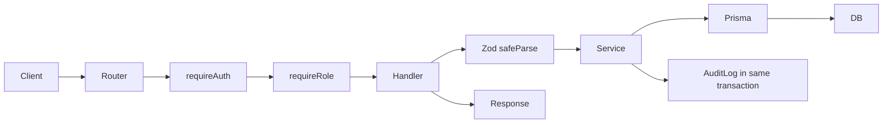
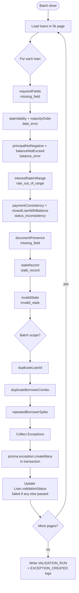
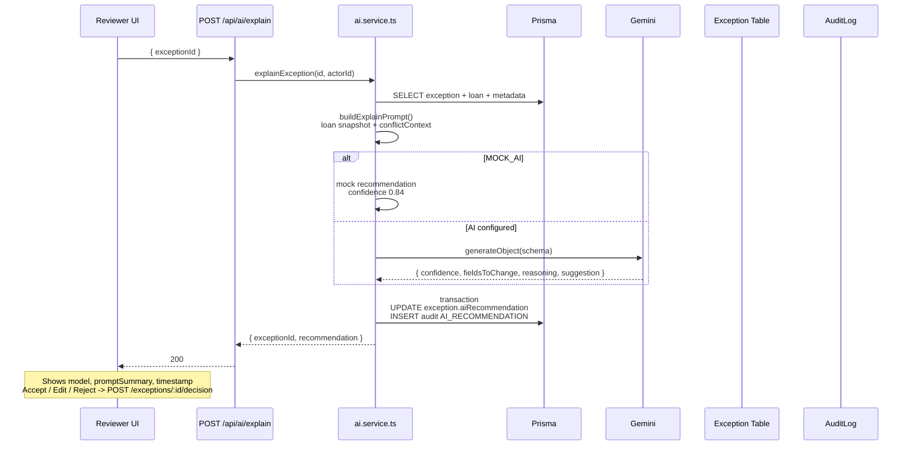
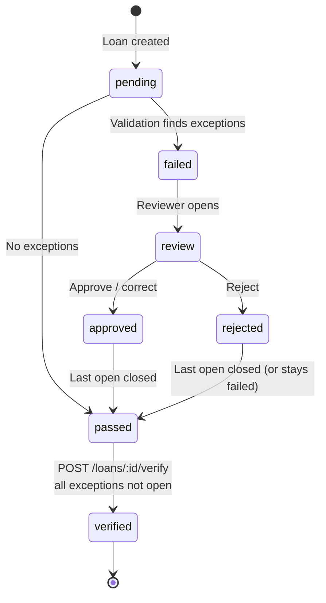
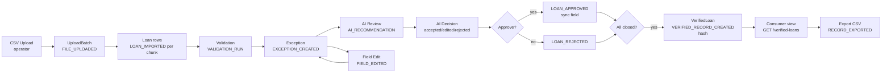

# Architecture Note - Luma Loan Data Verification Copilot

This note covers system design, data model, API design, validation engine, AI feature, audit trail, and trade-offs. Full specifications are in `.context/architecture-flow.md`, `.context/api-contract.md`, and `.context/implementation-plan.md`.

## Table of Contents

1. System Design
2. Data Model
3. API Design
4. Validation Engine
5. AI Feature
6. Audit Trail and Verification
7. Frontend and Deployment
8. Trade-offs

---

## 1. System Design

Luma is a Turborepo monorepo with two deployable apps and shared types.

*   **apps/web** - Vite SPA on port 3000. React 19, React Router 7, Tailwind CSS, shadcn/ui, TanStack Query. Client-side role routing through `ProtectedRoute`. Auth via `better-auth/react` `createAuthClient` with `withCredentials`. All API calls go through Vite proxy `/api -> http://localhost:4000`.
*   **apps/api** - Express 5 on port 4000, TypeScript, Zod validation. Owns ingestion, validation, AI, and Better Auth server. CORS allows `FRONTEND_URL` with credentials.
*   **Database** - PostgreSQL 16 through Prisma 7. One database holds Better Auth tables and app tables. Migrations live in `apps/api/prisma`.
*   **Auth** - Better Auth with Prisma adapter and `admin` plugin. Cookie session is `HttpOnly` and `SameSite=Lax`. Backend resolves sessions in `requireAuth` via `auth.api.getSession`. Role string on `User.role` is narrowed by `normalizeRole` to `data_operator`, `reviewer`, or `data_consumer`.
*   **File handling** - Multer writes to `os.tmpdir()/luma-uploads` (500 MB limit, `.csv` only). Ingestion uses `fs.createReadStream().pipe(csv-parser)` in 5000 row chunks. The request returns `202 Accepted` immediately; the frontend polls batch status.

The split keeps long lived streaming on Express and avoids timeout and memory pressure on the frontend.

### 1.1 High Level System Diagram



### 1.2 Request Flow



---

## 2. Data Model

Six tables. All ids are `cuid`. No soft deletes. Timestamps are `createdAt` and `updatedAt` where needed.

### 2.1 Entity Relationship

```mermaid
erDiagram
    User ||--o{ UploadBatch : uploads
    User ||--o{ AuditLog : acts
    UploadBatch ||--o{ Loan : contains
    UploadBatch ||--o{ AuditLog : batchEvents
    Loan ||--o{ Exception : has
    Loan ||--o{ AuditLog : loanEvents
    Loan ||--o| VerifiedLoan : verifiedAs
    Exception ||--o{ AuditLog : exceptionEvents
    VerifiedLoan ||--o{ AuditLog : verifiedEvents
    User ||--o{ VerifiedLoan : verifies

    User {
        string id PK
        string email UK
        string role
        string name
        boolean emailVerified
    }
    UploadBatch {
        string id PK
        string fileName
        string filePath
        string fileType
        int recordCount
        int processedCount
        int failedCount
        string status
        json metadata
        string uploadedById FK
    }
    Loan {
        string id PK
        string loanId
        string borrowerId
        string sourceBatchId FK
        int sourceRowNumber
        string validationStatus
        string importStatus
        json businessFields
    }
    Exception {
        string id PK
        string loanId FK
        string exceptionType
        string severity
        string field
        string message
        string status
        json aiRecommendation
        string correctedValue
    }
    VerifiedLoan {
        string id PK
        string loanId FK_UK
        json canonicalData
        string sourceBatchRef
        string validationResult
        string recordHash
        string verifiedById FK
    }
    AuditLog {
        string id PK
        string eventType
        string actorId FK
        string loanId FK
        string batchId FK
        string exceptionId FK
        json metadata
    }
```

### 2.2 Table Details

**User** - `id`, `email` unique, `role` default `data_consumer`, `name`, `emailVerified`. Better Auth adds `Session` and `Account` tables. Indexed on `email`.

**UploadBatch** - `id`, `fileName`, `filePath`, `fileType` (`loan_tape`, `servicer_update`, `document_manifest`), `recordCount` (final), `processedCount` (resume cursor), `failedCount`, `status` (`pending`, `processing`, `done`, `failed`), `metadata` (stage, `failedRows` array capped at 1000, error string), `uploadedById`, `createdAt`, `updatedAt`. Index on `uploadedById`.

**Loan** - `id`, `loanId` nullable, `borrowerId` nullable, `sourceBatchId` FK, `sourceRowNumber` (lineage), 21 business fields nullable (`loanType`, `originationDate`, `maturityDate`, `originalPrincipal`, `currentBalance`, `interestRate` as Decimal 15,2 and 5,4, `termMonths`, `borrowerState`, `loanPurpose`, `creditGrade`, `employmentLength`, `incomeBand`, `paymentStatus`, `daysPastDue`, `servicerName`, `lastPaymentDate`, `lastUpdatedAt`, `documentStatus`, `sourceSystem`), `validationStatus` (`pending`, `passed`, `failed`, `review`), `importStatus` (`imported`, `failed`). Constraint `@@unique([sourceBatchId, sourceRowNumber])` enables `createMany(skipDuplicates:true)` replay. Indexes on `sourceBatchId`, `validationStatus`, `loanId`.

**Exception** - `id`, `loanId` FK, `exceptionType` (9 values), `severity` (`critical`, `high`, `medium`, `low`), `field` nullable, `message`, `status` (`open`, `approved`, `rejected`, `corrected`), `reviewerId`, `reviewedAt`, `reviewerNote`, `aiRecommendation` JSON, `correctedValue`, `metadata` JSON, `createdAt`. Indexes on `loanId`, `status`, `severity`, `exceptionType`, `createdAt`.

**VerifiedLoan** - `id`, `loanId` unique FK, `canonicalData` JSON snapshot of current loan fields, `sourceBatchRef` (file name plus id), `validationResult` (`passed`, `passed_with_review`), `reviewerDecision`, `aiRecommendationUsed` boolean, `verifiedById` FK, `verifiedAt`, `recordHash` SHA256 hex. Index on `verifiedById`.

**AuditLog** - `id`, `eventType` (11 values), `actorId` nullable, `loanId`, `batchId`, `exceptionId`, `verifiedLoanId` nullable FKs, `metadata` JSON, `createdAt`. Indexes on `loanId`, `actorId`, `eventType`, `createdAt`. Append only. No updates or deletes.

---

## 3. API Design

Base URL `/api`. JSON for all routes except `POST /api/uploads` which is `multipart/form-data`. Errors are `{ code, error, fields? }` where `fields` is a map of Zod issues on 400.

All request bodies and queries are validated with Zod schemas shared in `packages/types`. No route trusts client input without `safeParse`.

### 3.1 Auth and RBAC

Better Auth mounts at `/api/auth/*`. Frontend uses `createAuthClient({ baseURL: FRONTEND_URL })` with `fetchOptions.credentials include`. In development Vite proxies `/api` to `4000` so cookies stay same origin.

Middleware order in `createApp`: `cors` -> `auth handler` -> `express.json` -> routers. `requireAuth` loads session and sets `req.user`. `requireRole(...roles)` returns `401` if missing and `403` if role not in list.

| Role | Allowed Groups |
|---|---|
| `data_operator` | `uploads`, `loans` read, `audit`, `summary`, `ai/summarize-batch`, `ai/suggest-rule` |
| `reviewer` | all `loans`, all `exceptions`, all `ai`, `verified-loans` read, `audit`, `summary` |
| `data_consumer` | `loans` verified only, `verified-loans`, `audit`, `summary` |

`GET /api/exceptions` is reviewer only. Operator uses `GET /api/uploads` and `GET /api/loans?validationStatus=failed`. `GET /api/loans/:id` for consumer checks `verifiedRecord` exists else 403.

### 3.2 Endpoint Table

| Group | Method and Path | Role | Notes |
|---|---|---|---|
| Auth | `POST /api/auth/sign-in/email` | public | sets cookie |
| Auth | `POST /api/auth/sign-out` | auth | clears cookie |
| Auth | `GET /api/auth/get-session` | auth |  |
| Uploads | `POST /api/uploads` | `data_operator` | 500 MB, csv only, 202 |
| Uploads | `GET /api/uploads` | `data_operator` | paginated, filtered by `uploadedById` |
| Uploads | `GET /api/uploads/:batchId` | `data_operator` | includes `failedRows` |
| Uploads | `GET /api/uploads/:batchId/summary` | `data_operator` | `totalImported`, `passed`, `failed`, `byType`, `bySeverity` |
| Loans | `GET /api/loans` | all (consumer verified only) | filter `batchId`, `validationStatus`, `search` |
| Loans | `GET /api/loans/:id` | all (consumer verified only) | includes `exceptions[]` and `verifiedRecord` |
| Loans | `PATCH /api/loans/:id/fields` | `reviewer` | allow list 7 fields, logs `FIELD_EDITED` |
| Loans | `POST /api/loans/:id/verify` | `reviewer` | checks all exceptions closed |
| Exceptions | `GET /api/exceptions` | `reviewer` | filters `status`, `severity`, `type`, `search`, `batchId` |
| Exceptions | `GET /api/exceptions/:id` | `reviewer` |  |
| Exceptions | `POST /api/exceptions/:id/comment` | `reviewer` | `REVIEWER_COMMENT` |
| Exceptions | `POST /api/exceptions/:id/approve` | `reviewer` | `LOAN_APPROVED`, syncs field if `correctedValue` |
| Exceptions | `POST /api/exceptions/:id/reject` | `reviewer` | `LOAN_REJECTED` |
| Exceptions | `POST /api/exceptions/:id/decision` | `reviewer` | records AI decision `accepted`, `edited`, `rejected` |
| AI | `POST /api/ai/explain` | `reviewer` |  |
| AI | `POST /api/ai/summarize-batch` | `reviewer`, `data_operator` | batch summary |
| AI | `POST /api/ai/classify-severity` | `reviewer` |  |
| AI | `POST /api/ai/suggest-rule` | `reviewer`, `data_operator` |  |
| AI | `POST /api/ai/draft-note` | `reviewer` |  |
| Verified | `GET /api/verified-loans` | `reviewer`, `data_consumer` | filter `validationResult`, `aiRecommendationUsed` |
| Verified | `GET /api/verified-loans/:id` | `reviewer`, `data_consumer` | `canonicalData` |
| Verified | `GET /api/verified-loans/export` | `data_consumer` | streams CSV, logs `RECORD_EXPORTED` |
| Audit | `GET /api/audit/:loanId` | all | paginated chronological |
| Summary | `GET /api/summary` | all | totals, `byType`, `bySeverity`, `recentActivity` |
| Health | `GET /api/health` | public | `{ status: ok }` |
| Me | `GET /api/me` | auth | `{ id, email, name, role }` |

Pagination uses `page` and `limit` (max 100). All list routes return `{ data, pagination: { limit, page, total, totalPages } }`.

### 3.3 API Layer Diagram



---

## 4. Validation Engine

Location `apps/api/src/services/validation.service.ts`. Runs automatically after ingestion completes. Uses thresholds from code (`validation_rules.json` logic inline: rate 0 to 40, stale 90 days).

### 4.1 Rule Flow



Per loan rules return an `Exception` object with `exceptionType`, `severity`, `field`, `message`. Batch scoped rules use DB queries:

*   `duplicateLoanId` - `groupBy` on `loanId` having count >1.
*   `duplicateBorrowerCombo` - `groupBy` on `borrowerId`, `originalPrincipal`, `originationDate`.
*   `repeatedBorrowerSpike` - counts per `borrowerId` over threshold.

All are done with batched `IN` queries in 5k windows, not in memory maps.

Execution is paginated 5000 at a time. Exceptions are created in bulk per chunk and `Loan.validationStatus` is updated in the same transaction. Summary endpoint reuses `groupBy` for `exceptionsByType` and `exceptionsBySeverity` and a distinct count `prisma.loan.count({ where: { sourceBatchId, exceptions: { some: {} } } })` to compute `failedValidation`. `passedValidation` is `max(0, totalImported - failedValidation)`.

Ingestion time failures (missing `loanId` and `borrowerId`, header mismatch, unparseable dates) do not create loans. They are stored in `UploadBatch.metadata.failedRows` as `{ rowNumber, rawData, reason }` capped at 1000 and shown on batch detail. Valid rows are inserted with `createMany(skipDuplicates:true)` which relies on `@@unique([sourceBatchId, sourceRowNumber])` for idempotent replay.

Example numbers with `loan_tape.csv` (137 rows): 8 failedRows, 129 imported, 60 loans with exceptions broken as `balance_error 13`, `duplicate 15`, `date_error 5`, `invalid_state 5`, `missing_field 5`, `rate_out_of_range 5`, `stale_record 5`, `status_inconsistency 10` with severities `critical 28`, `high 15`, `medium 15`, `low 5`. `servicer_update.csv` adds `conflicting_source` by matching `loanId` and comparing fields.

---

## 5. AI Feature

Provider is Google Gemini through Vercel AI SDK. Model is `gemini-3.5-flash-lite` configurable by `AI_MODEL_ID`. When `MOCK_AI=true` or `GEMINI_API_KEY` is empty the service returns deterministic mocks and never calls the network. All AI routes are rate limited to 20 per minute per user.

### 5.1 How It Works



The same pattern applies to `classify-severity` (returns `suggestedSeverity`), `draft-note` (returns `note`), `summarize-batch`, and `suggest-rule`.

### 5.2 Endpoints and Storage

| Endpoint | Input | AI Call | Stored Where | Extra |
|---|---|---|---|---|
| `explain` | `exceptionId` | `generateObject` with `confidence`, `fieldsToChange`, `reasoning`, `suggestion` | `Exception.aiRecommendation` JSON | also logs `AI_RECOMMENDATION` with `model`, `promptSummary`, `confidence` |
| `classify-severity` | `exceptionId` | `generateObject` with `suggestedSeverity` | not stored on exception, only audit | audit holds `currentSeverity`, `suggestedSeverity`, `reasoning` |
| `draft-note` | `exceptionId` | `generateObject` with `note` | not stored, returned only | audit holds `model`, `promptSummary` |
| `summarize-batch` | `batchId` | `generateText` with batch stats | not stored, audit only | aggregates `totalImported`, `passed`, `failed`, `byType`, `bySeverity` |
| `suggest-rule` | `prompt` string | `generateObject` with `name`, `description`, `condition`, `severity`, `exceptionType` | not stored | audit holds `ruleId`, `promptSummary` |

When AI is not configured and not mocked, the route returns `200` with `{ code: "AI_UNAVAILABLE", error, summary: null }` or `recommendation: null` and the UI shows a manual review message. It never returns 500.

### 5.3 Controls

*   Recommendations are shown in a read only card with model name, `promptSummary`, timestamp, and confidence. Text says AI suggestions require human review and do not automatically change data.
*   The reviewer must call `POST /api/exceptions/:id/decision` with `accepted`, `edited` (requires `editedValue`), or `rejected` before any field update. The decision is logged as `AI_RECOMMENDATION` with `aiDecision` and `editedValue`.
*   Approving an exception with `correctedValue` updates the loan field inside the same transaction and logs `LOAN_APPROVED` with the note.

---

## 6. Audit Trail and Verification

### 6.1 Append Only Log

`AuditLog` is append only. No updates or deletes. Every mutation that changes business state writes a log in the same `prisma.$transaction` as the change. The listed business events are `FILE_UPLOADED`, `LOAN_IMPORTED` (one per chunk, includes count and row range), `VALIDATION_RUN`, `EXCEPTION_CREATED`, `AI_RECOMMENDATION`, `REVIEWER_COMMENT`, `FIELD_EDITED` (stores `field`, `oldValue`, `newValue`, `reason`), `LOAN_APPROVED`, `LOAN_REJECTED`, `VERIFIED_RECORD_CREATED`, `RECORD_EXPORTED`. Internal `UploadBatch.metadata.pipelineStage` markers are not audit events.

`GET /api/audit/:loanId` returns logs ordered by `createdAt` ascending, paginated, with actor `name` and `role` and metadata.

### 6.2 Verification Lifecycle



`POST /api/loans/:id/verify` asserts no `status = open` remains else `409`. It builds `canonicalData` from the current loan fields (21 columns), computes `recordHash = SHA256(JSON.stringify(canonicalData))` in `lib/hash.ts`, creates `VerifiedLoan` with `sourceBatchRef` (file name and id), `validationResult` (`passed` or `passed_with_review`), `reviewerDecision`, `aiRecommendationUsed`, and writes `VERIFIED_RECORD_CREATED` with `hash` and `verifiedBy`.

### 6.3 End to End Flow



Consumers see only verified loans. `GET /api/loans` with role `data_consumer` adds `where verifiedRecord isNot null`. `GET /api/verified-loans/export` streams CSV with `Content-Disposition: attachment; filename="verified_loans_..."` and logs `RECORD_EXPORTED`.

---

## 7. Frontend and Deployment

Frontend route tree is in `apps/web/src/app/routes.tsx` behind `ProtectedRoute`.

```mermaid
graph TD
    ROOT[/] --> LOGIN[/login<br/>email + password]
    ROOT --> OP[/operator<br/>role=data_operator]
    ROOT --> REV[/reviewer<br/>role=reviewer]
    ROOT --> CON[/consumer<br/>role=data_consumer]
    ROOT --> AILOG[/ai-log]

    OP --> OPDash[/operator/dashboard<br/>upload history + validation summary]
    OP --> OPUpload[/operator/upload<br/>dropzone]
    OP --> OPImports[/operator/imports<br/>batch table]
    OP --> OPBatch[/operator/uploads/:batchId<br/>pipeline tracker + failedRows + summary + AI summary]
    OP --> OPLoans[/operator/loans<br/>read only drawer]

    REV --> RVDash[/reviewer/dashboard<br/>queue stats]
    REV --> RVQueue[/reviewer/exceptions<br/>filterable table]
    REV --> RVLoan[/reviewer/loans/:id<br/>editable fields + AI panel + actions]
    REV --> RVRules[/reviewer/rules<br/>suggest-rule]

    CON --> CNDash[/consumer/dashboard<br/>quality score + verified table]
    CON --> CNLoan[/consumer/verified/:id<br/>canonical + audit]
    CON --> CNAudit[/consumer/audit/:loanId<br/>timeline]
    CON --> CNAPI[/consumer/api<br/>explorer]
```

Data fetching uses TanStack Query. `useUploadBatch` polls every 1.5s while `status=processing`. Mutations invalidate `uploads`, `loans`, `exceptions`, `audit`, `summary` keys. All fetchers use `axios` with `withCredentials`.

Deployment is split. `apps/api` needs `DATABASE_URL` and `FRONTEND_URL`. `apps/web` is a static build from `dist` (Vite). Local workflow is `docker compose up -d`, `prisma migrate dev`, `prisma generate`, `seed`, `bun run dev`. CI runs `lint` (`ultracite check`), `typecheck` (`turbo check-types`), `build` (`turbo build`) on push and PR to `main` with required checks and branch must be up to date. Same three checks run on pre-commit via `lefthook`.

---

## 8. Trade-offs

| Decision | Chosen | Alternative | Rationale |
|---|---|---|---|
| CSV storage | Local disk `os.tmpdir()/luma-uploads` | DB blob or S3 | DB bloats on 1M rows, S3 adds setup for hackathon. Disk allows streaming reads and Multer. |
| Job processing | Streaming `createReadStream` plus DB cursor `processedCount` in 5k chunks | BullMQ plus Redis | No extra service. `@@unique([sourceBatchId, sourceRowNumber])` plus `skipDuplicates` makes replay idempotent after crash. |
| Duplicate detection | DB `groupBy` and batched `IN` queries in 5k windows | In-memory hash map | Memory stays flat for large batches. |
| Header handling | Strict 21 column `KNOWN_COLUMNS` check, fail batch on mismatch | Accept any delimiter | Public Fannie/Freddie samples are pipe delimited with 108 columns and would create all null loans. Synthetic packet is comma 21 columns for judging. |
| AI output | `generateObject` with Zod | Free form string | Parsable, storable, auditable, validated. |
| AI provider | Gemini free tier | OpenAI | No cost for structured output. `MOCK_AI=true` removes key dependency for CI and demo. |
| Session | Cookie `HttpOnly` | JWT in header | Better Auth default, no refresh logic, single origin through Vite proxy. |
| Monorepo | Turborepo | Nx | Light config, shared `packages/types` without extra tooling. |
| Hashing | SHA256 of `canonicalData` JSON | Merkle tree | Enough tamper evidence at this scale. |
| Transactions | `prisma.$transaction` | Manual SQL | Automatic rollback and clear handling. |
| Batch summary | Recompute via `groupBy` on read | Store denormalized counts | Always consistent, no stale counters. |
| Frontend polling | TanStack Query 1.5s while `processing` | WebSocket | Simple, no extra server. |
| File limits | Multer 500 MB, csv-parser | Papaparse in memory | Stream avoids OOM on 1M rows. |
